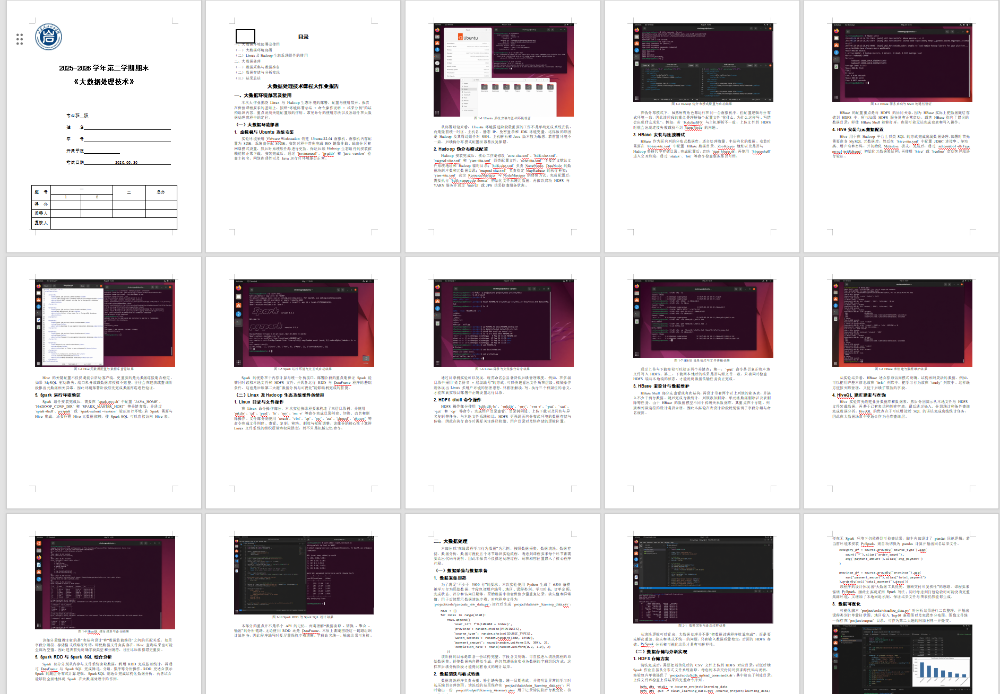
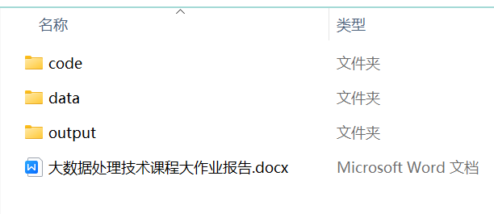

<div align="center">

# AutoLab.skill

**把作业要求、Word 模板、截图和提交包整理成可交付的报告文件。**

[](https://opensource.org/licenses/MIT)
[](#)
[](https://www.python.org/)

</div>

---

## 实验报告排版复杂？

学校发的 Word 模板不好填。  
截图、流程图、ER 图、运行结果也要整理。  
最后还要调格式、清占位符、打包提交。

---

## 它能做什么

目前主要覆盖这些类型：

- 数据分析实验报告
- Linux / 操作系统实操报告
- Python / Java / Web 开发报告
- 管理系统课程设计
- 数据库设计、ER 图、流程图、架构图
- Word 模板填写、图文排版、提交包整理

重点不是只写正文，而是把报告相关的文件一起整理好。

---

## Quick Start

把这段发给 AI Agent，让它先完成初始化：

```text
请读取并初始化这个 skill：

https://github.com/qiuy-collab/Auto-Lab.skill

请只做初始化，不要开始生成报告。

需要完成：
1. 克隆仓库。
2. 阅读 SKILL.md。
3. 按 SKILL.md 检查运行环境。
4. 自动安装基础依赖。
5. 检查 vendor skills 是否完整。
6. 运行环境检查脚本。
7. 如果缺少 API Key、Word 模板、作业要求或其他文件，直接列出来让我补。

注意：
- 不要修改原始 Word 模板。
- 不要跳过 SKILL.md 里的检查点。
- 初始化完成后先停下，等我继续给任务文件。
```

---

## 运行效果

这里放的是一个《大数据处理技术》课程大作业示例。

这次示例里，输入是一份作业要求和一个 Word 模板，最后整理出了报告、代码、数据、图表和提交文件。

### 生成的报告



### 交付文件



### 示例内容

| 内容 | 结果 |
|---|---|
| 作业要求 | 《大数据处理技术》课程大作业 |
| 报告 | `大数据处理技术课程大作业报告.docx` |
| 代码 | 数据生成、清洗、分析、可视化脚本 |
| 数据 | 原始数据、清洗后数据 |
| 输出 | CSV 结果、图表 |
| 截图 | 12 张终端 / IDE 实验截图 |

```text
examples/big-data-processing-report/
├── 需求/
│   └── 《大数据处理技术》.docx
├── 交付/
│   ├── 大数据处理技术课程大作业报告.docx
│   ├── code/
│   ├── data/
│   └── output/
└── 效果图/
    ├── 生成的文档截图.png
    └── 交付文件.png
```

---

## Project Structure

```text
Auto-Lab.skill/
├── SKILL.md                   # skill 执行指南
├── README.md                  # 项目说明
├── .env.example               # AI 截图接口配置示例
├── scripts/                   # 核心脚本
│   ├── init_run.py            # 初始化运行目录
│   ├── run_workflow.py        # 工作流验证与执行
│   ├── generate_images.py     # AI 截图生成
│   └── package_submission.py  # 提交文件打包
├── examples/                  # 示例任务
│   └── big-data-processing-report/
├── docs/                      # 规则文档
└── vendor/                    # 配套 skill
    ├── minimax-docx/
    ├── baseline-ui/
    ├── frontend-design/
    └── webapp-testing/
```

---

## Star History

[](https://www.star-history.com/#qiuy-collab/Auto-Lab.skill&Date)

---

## License

MIT License © [qiuy-collab](https://github.com/qiuy-collab)
