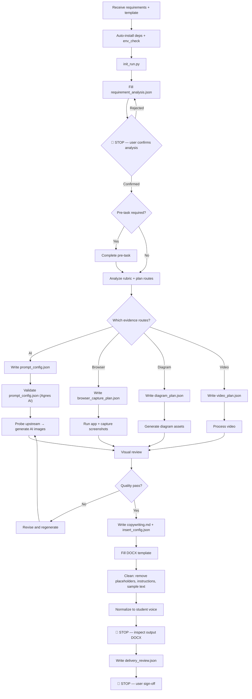

# auto-lab

Use this skill when the user wants a lab report generated from a requirement document and a Word template while preserving the template structure.

The executable workflow expects a `.docx` template for `python-docx` processing. If the user only has `.doc`, convert it before running `init_run.py`.

## Environment setup (agent-automated)

The agent MUST install all dependencies automatically before running any script. Do not ask the user to install anything manually.

### Vendor skills (shipped with repo)

The `vendor/` directory contains skills shipped with this repo. No installation needed — they are included when the user clones/forks the repo.

Check at startup:
- `vendor/minimax-docx/SKILL.md` — for DOCX structural editing
- `vendor/baseline-ui/SKILL.md` — for frontend baseline constraints
- `vendor/frontend-design/SKILL.md` — for frontend implementation quality
- `vendor/webapp-testing/SKILL.md` — for web-app verification

If any vendor skill is missing, report the error and stop — do not silently skip.

### Required dependencies (install silently)

```bash
pip install requests python-docx Pillow
```

### Optional dependencies (install when route requires)

| Route | Install command |
|-------|----------------|
| `browser_capture` | `pip install playwright && playwright install chromium` |
| `video_analysis` / `screen_recording` | `pip install av opencv-python numpy mss` |
| `ai_simulated` | No extra pip install, but requires `.env` with `BASEURL` and `APIKEY` |

### Auto-setup procedure

1. Check if `python` is available. If not, report to user and stop.
2. Check vendor skills exist in `vendor/` directory. If any missing, report error and stop.
3. Run `pip install requests python-docx Pillow` silently.
4. If `ai_simulated` route is planned, check `.env` exists and has `BASEURL`+`APIKEY`. If missing, copy `.env.example` to `.env` and ask the user to fill in the API key.
5. If `browser_capture` route is planned, run `pip install playwright && playwright install chromium`.
6. If video route is planned, run `pip install av opencv-python numpy mss`.
7. After installs, run `powershell -ExecutionPolicy Bypass -File scripts/env_check.ps1` to verify.
8. If env_check still reports FAIL after auto-install, report the specific failure to the user with the exact fix command. Only ask the user for manual intervention when auto-install cannot resolve it.

**Rule**: Environment issues are the agent's responsibility to fix. Only ask the user for semantic decisions (route choice, content review, delivery sign-off), not for `pip install`.

## Quick start

```
1. Auto-install dependencies (see "Environment setup" above)
2. python scripts/init_run.py --requirements <req> --template <tpl.docx> --output-dir <dir> --output-docx-name <result.docx>
3. Fill requirement_analysis.json → update requirement_checklist.json
4. 🔴 STOP — show analysis to user for confirmation
5. If pre-task needed → complete it → record in pre_task_plan.json
6. Plan figures → write copywriting.md + prompt_config.json + insert_config.json
7. python scripts/run_workflow.py gate --workflow <workflow.json>
8. python scripts/validate_prompt.py --config <output_dir>/prompt_config.json (REQUIRED if AI images)
9. python scripts/generate_images.py --check (if AI images needed)
10. python scripts/run_workflow.py images --workflow <workflow.json>
11. python scripts/run_workflow.py run --workflow <workflow.json>
12. 🔴 STOP — inspect output DOCX
13. Write delivery_review.json → 🔴 STOP — user sign-off
```

## Core behavior

- Default target tier is `excellent`.
- Scripts are the execution layer; the agent is the decision layer.
- If a choice depends on the assignment's actual meaning, grading intent, deliverable wording, or project reality, decide it from the requirement/prompt instead of from script defaults.
- The agent must read scoring requirements before writing.
- If the requirement depends on a pre-task such as building a system, implementing pages, preparing data, or producing intermediate artifacts, the agent must complete that pre-task before report writing.
- Only treat work as a mandatory pre-task when the requirement document explicitly requires real deliverables such as code, scripts, datasets, runnable data, project files, or other concrete outputs that the report depends on.
- Do not satisfy pre-tasks with demo-grade placeholder code, mock outputs, or "just enough to show something" artifacts. If the requirement asks for code, the code must be usable, requirement-aligned, documented, and handoff-ready.
- When a pre-task includes frontend or web-app implementation, the agent must initialize a git repository before coding and must use the vendored skill references for `baseline-ui`, `frontend-design`, and `webapp-testing`.
- "Pre-task completed" means the same quality bar as any normal coding delivery: required functionality implemented, required assets prepared, basic startup instructions documented, and tests or runtime checks performed.
- The agent must decide the figure plan before writing copy.
- The report voice must be that of a student submitting coursework, never that of an agent, assistant, or tool explaining what it did.
- `auto-lab` supports three visual routes:
  - `ai_simulated`: AI-generated realistic screenshots
  - `browser_capture`: real screenshots from the user's own local frontend/app flow
  - `diagram_assets`: generated diagrams for course-design figures such as function diagrams, flowcharts, data flow diagrams, and ER diagrams
- `auto-lab` also supports video evidence:
  - `video_analysis`: analyze existing operation videos and extract representative frames
  - `screen_recording`: record short local operation clips when screenshots are not enough
- `auto-lab` also supports prompt-driven submission packaging:
  - derive required deliverables from the requirement/prompt
  - package them as `submit.zip`
- A run may use one route or multiple routes together.
- A fresh run directory starts in a neutral planning state. Before validation or execution, fill `requirement_checklist.json` and choose the real route combination.

## Vendored companion skills

When the requirement includes real software delivery work, read and apply these vendored skill entrypoints before implementation:

- `vendor/minimax-docx/SKILL.md` for DOCX-safe structural editing
- `vendor/baseline-ui/SKILL.md` for frontend baseline constraints
- `vendor/frontend-design/SKILL.md` for production-grade frontend implementation quality
- `vendor/webapp-testing/SKILL.md` for local web-app testing and verification

If a vendor skill file is missing, report it as an error — do not silently skip.

## Agent decision guide

This section tells the agent **how to think**, not just what to do. Every decision below is the agent's responsibility — scripts cannot make these choices.

### Route selection decision tree

When the requirement mentions screenshots, figures, or visual evidence, follow this tree:

```
Requirement mentions "运行截图" / "运行效果" / "运行结果"
  ├─ Refers to the user's own frontend/app pages?
  │   └─ YES → browser_capture
  │   └─ NO (terminal, config panel, IDE, database tool) → ai_simulated
  │
Requirement mentions "流程图" / "ER图" / "数据流图" / "功能图" / "架构图"
  └─ diagram_assets
  │
Requirement mentions "操作视频" / "录屏" / "运行演示"
  ├─ Has existing video file? → video_analysis
  └─ Needs new recording? → screen_recording
  │
Requirement says "截图" without specifying
  └─ Default to ai_simulated (cheaper, faster, no local server needed)
  └─ Only switch to browser_capture if the content MUST match a running local build
```

**Critical judgment**: When the requirement says "真实截图" (real screenshots), it means AI-generated realistic screenshots — NOT actual local screenshots. The word "真实" describes the visual style (realistic-looking), not the capture method. Only use `browser_capture` when the requirement explicitly refers to pages from the user's own app.

### Figure count judgment

How many figures does the report need? Judge by:

1. **Count scoring items that require visual evidence.** Each item needing a screenshot/diagram = at least 1 figure.
2. **Count template placeholders.** `{{img_XX}}` in the template = exact figure count.
3. **Map figures to headings.** Each major section (level-1 or level-2 heading) that describes a system, process, or result should have at least 1 figure.
4. **Minimum for "excellent" tier**: typically 5-8 figures for a course-design report. Fewer than 5 usually means missing evidence.
5. **Maximum**: do not exceed 12 figures unless the rubric explicitly requires more. Excess figures dilute quality.

Record the final count and placement in `requirement_checklist.json -> planned_figures`.

### Pre-task judgment

Read the requirement document and ask:

1. Does the requirement name specific deliverables that must exist BEFORE the report? (code, datasets, running system, database, project files)
2. Does the report need to reference, analyze, or screenshot something that doesn't exist yet?
3. If YES to either → pre-task required. Complete it first.
4. If the requirement only asks for writing, analysis, or explanation of provided materials → no pre-task.

When a pre-task exists, the report narrative must weave in pre-task outputs — not treat them as separate appendices.

### Content strategy

For each report section, decide:

| Section type | Content focus | Figure placement |
|-------------|--------------|-----------------|
| Introduction / Background | Problem context, significance, objectives | No figure needed |
| Requirements analysis | Functional requirements, use cases | UML use-case diagram if applicable |
| System design | Architecture, modules, data flow | Architecture diagram + data flow diagram |
| Implementation | Code walkthrough, key algorithms | Code screenshots (browser_capture for own app, ai_simulated for IDE) |
| Testing | Test cases, results, screenshots | Test result screenshots |
| Conclusion | Summary, limitations, future work | No figure needed |

The agent must decide this mapping for each specific assignment — do not apply a fixed template across all reports.

### Quality judgment thresholds

When to keep an image:
- Text is readable at normal report zoom
- Background is believable (not blank white or obviously AI-generated)
- No localhost / 127.0.0.1 / dev URLs visible
- UI elements look realistic (not twisted or warped)

When to regenerate:
- Text is blurry or too small to read
- Background is cluttered or unrealistic
- localhost or dev URLs are visible
- UI elements are obviously broken

**STRICT RULE**: After 2 regeneration rounds, if quality still fails, DO NOT silently skip or use text instead. Report the specific failure to the user and ask them to:
1. Revise the prompt in `prompt_config.json` to address the issue, OR
2. Explicitly approve skipping this image.

### User communication at checkpoints

Each 🔴 STOP point has a specific display format:

| Checkpoint | What to show the user | What to wait for |
|-----------|----------------------|-----------------|
| After requirement analysis | The filled `requirement_analysis.json` + `requirement_checklist.json` summary: routes chosen, pre-task yes/no, figure count, packaging scope | "确认" or corrections |
| After validation errors | The specific error messages from `run_workflow.py validate` | User acknowledgment or file fixes |
| After upstream probe failure | The error from `generate_images.py --check` + exact fix instruction (which config to correct) | User fixes upstream config — NO fallback proposal |
| After DOCX output inspection | A bullet list of what was checked and what passed/failed | User approval to proceed to packaging |
| After delivery review | The `delivery_review.json` content | Final sign-off |

Do not dump raw JSON at the user. Summarize into 3-5 bullet points and ask for confirmation.

### Template analysis procedure

Before writing any fill script:

1. Open the template with `python-docx` and list all paragraphs with their style names.
2. Identify the cover zone (everything before the first level-1 heading) → preserve exactly.
3. Identify fillable zones (body paragraphs between level-1 headings) → these get replaced.
4. Identify fixed labels ("课程名称：", "姓名：", "学号：") → keep the label, fill the value.
5. Identify `{{img_XX}}` placeholders → plan figure placement.
6. Check for TOC fields → decide whether to update or remove.
7. Check for format instructions ("字号要求：小四") → mark for removal.
8. Record findings in `template_manifest.json`.

### Rubric-to-evidence mapping

When the grading rubric has items like:

| Rubric keyword | Evidence type | Route |
|---------------|--------------|-------|
| "系统截图" / "运行截图" | Screenshots of running system | ai_simulated or browser_capture |
| "流程图" / "功能图" | Diagrams | diagram_assets |
| "测试结果" | Test output screenshots | ai_simulated (terminal) or browser_capture (UI) |
| "数据库设计" | ER diagrams | diagram_assets |
| "界面展示" | UI screenshots | browser_capture (own app) |
| "代码展示" | Code screenshots | ai_simulated (IDE) |

For each rubric item requiring evidence, add a corresponding entry to `planned_figures`.

### Student voice calibration

The report must read like a student wrote it. Examples:

| Wrong (agent voice) | Right (student voice) |
|--------------------|-----------------------|
| "I have generated the following screenshots" | "系统运行效果如图X所示" |
| "The AI produced this diagram" | "本系统的功能结构如图X所示" |
| "I implemented the frontend using React" | "前端采用React框架实现" |
| "This image was created by the tool" | "测试结果如图X所示" |
| "Let me explain the architecture" | "系统架构设计如图X所示" |

Rule: never mention the tool, agent, AI, or generation process. Write as if you built the system and took the screenshots yourself.

## Workflow diagram



## Failure modes and recovery

| Scenario | Trigger | First action | Fallback |
|----------|---------|-------------|----------|
| Python not found | `python` command fails | Report to user with install instructions | Stop — cannot proceed |
| pip install fails | Network or permission error | Retry once with `--user` flag | Ask user to install manually |
| `.env` missing or incomplete | No `BASEURL`/`APIKEY` | Copy `.env.example` to `.env` | Ask user to fill API key |
| `env_check.ps1` reports FAIL | Missing module or tool | Auto-install the missing dependency | Report exact fix command to user |
| `init_run.py` error | Template not `.docx` / path missing | Check file path and format, retry | Ask user to confirm file |
| Upstream image API unreachable | `--check` returns failure | Report error to user with diagnostic info — DO NOT silently fall back | **No silent fallback allowed.** User must fix API config or explicitly approve route switch |
| Single AI image fails | API timeout / empty response | Auto-retry 3 times (built into script) | Record failed image name; if >50% fail, abort and tell user to fix upstream |
| **ALL AI images fail** | All retries exhausted | **Raise SystemExit — stop immediately** | **FORBIDDEN: do not fall back to diagram_assets or text-only without explicit user approval** |
| Visual review fails | localhost in image / density too high / overlaps | Revise prompt, regenerate (max 2 rounds) | If still fails after 2 rounds, ask user to review and decide whether to keep or regenerate |
| Prompt validation fails | Prompt contains forbidden terms or is inconsistent | **Report issues to user, do not proceed** | User must fix prompt_config.json before generation
| Template fill script errors | `task_scripts/*.py` exception | Check if stub was replaced, fix paths | Fall back to `python-docx` simple fill, record reason in `requirement_analysis.json -> template_strategy.notes` |
| Video processing fails | PyAV/OpenCV both unavailable | Check ffmpeg installation | Skip video evidence, set `video_required=false` in checklist |
| Submission packaging fails | Files in `include_paths` don't exist | Check paths, fix `submission_package.json` | Stop, ask user to confirm files |
| Vendor skill file missing | `vendor/*/SKILL.md` not found | Report the specific missing skill name | Stop — do not silently skip |
| DOCX output has leftover placeholders | Gate 5/AG check命中 | Locate and replace each one with actual content | Re-run fill script |

## Anti-patterns — do NOT do these

| # | Anti-pattern | Consequence | Correct approach |
|---|-------------|-------------|-----------------|
| 1 | Use local scripts to generate fake screenshots when AI generation fails | Teacher spots fake images instantly, direct point deduction | Retry, skip the image, or switch routes |
| 2 | Overwrite the original template file | Template destroyed, no rollback | Always output to a new file |
| 3 | Let scripts make semantic decisions (how many images, which route) | Scripts don't understand course requirements | Agent decides, scripts execute |
| 4 | Use "dashboard" / "note" / "welcome" placeholder text in frontend code | Obviously template code | Use real content from the requirement document |
| 5 | Skip vendor skills and write frontend directly | Violates baseline-ui constraints | Read vendor/*.md before writing code |
| 6 | Deliver only `submit.zip` without a `submit/` folder | Hard to inspect and modify | Output both folder and zip |
| 7 | Add "AI版" / "完整版" / "final" suffixes to zip filename | Non-standard naming | Use `submit.zip` uniformly |
| 8 | Leave "请在此处填写" / "字号要求" template instructions in output DOCX | Teacher sees format rules instead of content | Remove all, keep only student content |
| 9 | Agent self-evaluates after making changes | Optimistic bias (accuracy only 46.4%) | Use independent sub-agent or human review |
| 10 | Run the entire workflow without any human confirmation | May go off-track irreversibly | Stop at every 🔴 checkpoint, wait for user |
| 11 | Fabricate timestamps in AI-generated screenshots | Unrealistic images | Use real current time in prompt |
| 12 | Use generic placeholder code in AI code/IDE screenshots | Screenshot doesn't match actual project | Pick core code snippets from the project for the prompt |
| 13 | Stack multiple captions after one image, or group captions at section end | Figure and caption mismatch, teacher can't match them | One caption per image, placed immediately after it |

## Image routes — hard boundaries

### Route 1: `ai_simulated`

Use AI-generated screenshots for:
- terminal screenshots
- command output screenshots
- software / system configuration screenshots
- generic tool-operation visuals where exact local UI fidelity is not required
- IDE / code editor screenshots (when showing general coding environment)
- database management tool screenshots (e.g. MySQL Workbench, Navicat general UI)
- network/OS configuration panels

**Critical rule**: When the requirement says "real software screenshots" or Chinese equivalent, it means AI-generated realistic screenshots by default — NOT local browser capture and NOT fake local script outputs. Only use `browser_capture` when the requirement explicitly refers to the user's own frontend/app pages.

Do not use AI-generated screenshots for:
- local frontend pages that should match the running project
- self-built app/web product flows
- development software practice screenshots for the user's own app or web project
- function diagrams, flowcharts, data flow diagrams, or ER diagrams

### Route 2: `browser_capture`

Use browser/app screenshots for:
- frontend pages that require starting a local dev server
- pages from the user's own app or web project
- development software practice screenshots for the user's own app/web flow

Do not use browser capture for:
- unrelated third-party published apps
- terminal screenshots
- generic configuration figures that fit the AI route better
- function diagrams, flowcharts, data flow diagrams, or ER diagrams

### Route 3: `diagram_assets`

Use generated diagram assets for:
- function diagrams
- flowcharts
- data flow diagrams
- ER diagrams
- database schema diagrams
- system architecture diagrams (when specifically asked as diagrams, not as screenshots)

Do not use diagram assets for:
- terminal screenshots
- command output screenshots
- local frontend page screenshots
- published third-party product screenshots

### AI image constraints

- AI-generated screenshots with clock/time displays must show the **real current time**. Note the current date/time before generating and include it in the prompt.
- AI-generated code/IDE screenshots should use the **project's actual source code**. Pick the most representative snippet (main entry point, key class, or core logic) and include it in the prompt for visual fidelity.
- If AI image generation fails, do NOT fall back to local fake screenshots. Retry, skip, or switch routes.
- Before batch AI image generation, always validate prompts: `python scripts/validate_prompt.py --config <output_dir>/prompt_config.json`
- After prompt validation passes, probe upstream: `python scripts/generate_images.py --check`

## Template filling rules

When filling a DOCX template:
- **Preserve**: template structure, heading hierarchy, page layout, table structure, styles, cover page, fixed text that is part of the assignment format (e.g. "课程名称：", "姓名：").
- **Remove**: template instructions ("请在此处填写", "（此处替换为...）"), format reminders ("字号要求：小四", "行距：1.5倍"), sample/example content, placeholder hints, rubric excerpts pasted as body text, and TOC residue that is empty or broken.
- **Replace**: all placeholder text like `[TODO]`, `占位`, `示例内容`, `样例` with actual student-content.
- **Use** `scripts/template_adapter.py` as a reusable library: `find_placeholders()`, `replace_placeholder_text()`, `insert_image_after_paragraph()`, `remove_template_instructions()`, `validate_output()`, `write_fill_script()`.
- The agent must customize `task_scripts/fill_template.py`, `insert_images.py`, and `verify_template.py` using `template_adapter` functions rather than writing everything from scratch.
- The final report must not contain teacher-facing instructions or format specifications as body paragraphs.

### Figure-caption pairing rule

Every image MUST have its own caption immediately after it. The structure for each figure must be:

```
[lead-in sentence describing what the figure shows]
[blank line]
[the image itself]
[blank line]
[figure caption: "图X  描述文字"]
[blank line]
[short analysis paragraph]
```

**Strict rules**:
- Each image gets exactly one caption. Never stack multiple captions after a single image.
- Never stack multiple images with a single shared caption.
- Captions must not be grouped together at the end of a section. They must stay paired with their respective images.
- The pattern is always: lead-in → image → caption → analysis. One unit per figure.
- If the template has `{{img_01}}` placeholders, each placeholder should be followed by its caption paragraph before the next placeholder.
- After filling, verify that every `{{img_XX}}` has a caption within 2 paragraphs below it. If a caption is missing or misaligned, fix it before delivery.

## Frontend code constraints

When implementing frontend code as a pre-task:
- Do not use placeholder text like "dashboard", "note", "placeholder", "示例", "样例" in visible UI.
- Do not use generic template copy (e.g., "Welcome to your dashboard", "Note content here").
- All visible text must be real content derived from the requirement.
- Code must be runnable, requirement-aligned, and handoff-ready — not demo-grade.

## Execution steps

1. **Auto-install dependencies** (see "Environment setup" above). Run `env_check.ps1` to verify.
2. **Initialize run directory**:
   ```
   python scripts/init_run.py --requirements <req> --template <tpl.docx> --output-dir <dir> --output-docx-name <result.docx>
   ```
3. **Read generated files**: `workflow.json`, `template_manifest.json`, `requirement_checklist.json`, `requirement_analysis.json`, `pre_task_plan.json`, `copywriting.md`, `prompt_config.json`, `browser_capture_plan.json`, `diagram_plan.json`, `video_plan.json`, `reference_template_cleanup.json`, `submission_package.json`, `insert_config.json`, `task_scripts/fill_template.py`, `task_scripts/insert_images.py`, `task_scripts/verify_template.py`.
4. **Fill `requirement_analysis.json`**, then reflect decisions into `requirement_checklist.json`.
5. 🔴 **STOP — show analysis to user for confirmation.** Do not continue until approved.
6. **Decide routes**: pre-task required? images required? which routes? video? submission package? Use `docs/prompts/pre_task_detection_rules.md` for pre-task judgment.
7. **If pre-task required**, complete it first. For frontend: init git, read vendor skills, build, write README, verify with webapp-testing. Record outputs in `pre_task_plan.json`.
8. **Analyze template** and customize `task_scripts/fill_template.py`, `insert_images.py`, `verify_template.py`.
9. **Write config files** as one coordinated set: `copywriting.md`, `prompt_config.json`, `browser_capture_plan.json`, `diagram_plan.json`, `video_plan.json`, `reference_template_cleanup.json`, `submission_package.json`, `insert_config.json`. Read `docs/prompts/prompt_driven_decisions.md` before writing.
10. **Visual review** per `docs/prompts/visual_review_rules.md`. Set `ai_visual_review_completed` / `diagram_visual_review_completed` only after passing.
11. **Validate**: `python scripts/run_workflow.py validate --workflow <workflow.json>`. 🔴 **STOP if errors** — fix before continuing.
12. **Validate prompts** (if AI images): `python scripts/validate_prompt.py --config <output_dir>/prompt_config.json`. 🔴 **STOP if fails** — fix prompt_config.json.
13. **Probe upstream** (if AI images): `python scripts/generate_images.py --check`. 🔴 **STOP if fails** — fix upstream config, do NOT fall back.
14. **Generate images**: `python scripts/run_workflow.py images --workflow <workflow.json>`.
15. **Process video** (if needed): `python scripts/run_workflow.py video --workflow <workflow.json>`.
16. **Package submission** (if needed): `python scripts/run_workflow.py package --workflow <workflow.json>`.
17. **Fill DOCX**: `python scripts/run_workflow.py run --workflow <workflow.json>`. 🔴 **STOP — inspect output**. Check for: leftover placeholders, broken TOC, agent-voice, template instructions as body text, missing images.
18. **Delivery review**: list every required deliverable, check each for correctness. Write `delivery_review.json`. 🔴 **STOP — user sign-off**.

## Multi-upstream parallel generation

When generating many AI images, distribute work across multiple upstream API providers to reduce total time.

### Configuration

**`.env`** — comma-separated mode (recommended):
```env
BASEURLS:https://api1.example.com,https://api2.example.com
APIKEYS:sk-key1,sk-key2
```

Or numbered mode:
```env
BASEURL1:https://api1.example.com
APIKEY1:sk-key1
BASEURL2:https://api2.example.com
APIKEY2:sk-key2
```

**`prompt_config.json`** — key fields:
```json
{
  "upstream_count": 2,
  "max_workers": 4,
  "max_retries": 3,
  "timeout": 180,
  "images": [...]
}
```

### Sharding logic

Each upstream gets `index % upstream_count == upstream_index` of the images:

| Upstream | Images (8 total, 2 upstreams) |
|----------|------------------------------|
| 上游0 | img_1, img_3, img_5, img_7 |
| 上游1 | img_2, img_4, img_6, img_8 |

### Running

```bash
# Terminal 1 (upstream 0 → handles even-indexed images)
python scripts/generate_images.py --config prompt_config.json --upstreams 2 --upstream 0

# Terminal 2 (upstream 1 → handles odd-indexed images)
python scripts/generate_images.py --config prompt_config.json --upstreams 2 --upstream 1

# Single-upstream mode (backward compatible, no sharding)
python scripts/generate_images.py --config prompt_config.json
```

### Expected performance

- 8 images, 1 upstream: ~120 seconds
- 8 images, 2 upstreams: ~60 seconds
- 8 images, 3 upstreams: ~45 seconds
- Scales near-linearly with upstream count (limited by `max_workers`)

## Files created by init_run.py

- `workflow.json`
- `template_manifest.json`
- `requirement_checklist.json`
- `requirement_analysis.json`
- `pre_task_plan.json`
- `copywriting.md`
- `prompt_config.json`
- `prompt_validation_report.json` (after validation)
- `browser_capture_plan.json`
- `diagram_plan.json`
- `video_plan.json`
- `reference_template_cleanup.json`
- `submission_package.json`
- `insert_config.json`
- `task_scripts/*.py`

## JSON contracts

### requirement_checklist.json

Complete before report writing. Must record: `has_grading_rubric`, `target_tier`, `run_mode`, `pre_task_required`, `images_required`, `ai_images_required`, `browser_capture_required`, `diagram_assets_required`, `video_required`, `reference_template_cleanup_required`, `submission_package_required`, `ai_visual_review_completed`, `diagram_visual_review_completed`, `minimum_image_count`, `planned_figures`.

Cross-rules:
- `ai_images_required=true` → `prompt_config.json` must be populated
- `browser_capture_required=true` → `browser_capture_plan.json` must be populated
- `diagram_assets_required=true` → `diagram_plan.json` must be populated
- `video_required=true` → `video_plan.json` must be populated, `video_review_completed` must be `true`
- `submission_package_required=true` → `submission_package.json` must be populated, output must be both `submit/` folder and `submit.zip`
- `pre_task_required=true` → `pre_task_plan.json` must be enabled and completed
- `ai_visual_review_completed` and `diagram_visual_review_completed` must only be `true` after agent has visually inspected the images

### requirement_analysis.json

The agent's decision record. Fill after reading requirement, template, and project artifacts. Source of truth for semantic decisions. Must explain why each route was chosen and why pre-task is or is not required.

### delivery_review.json

Machine-checkable final acceptance record. Every required deliverable must appear with `present`, `correct`, and `notes` fields. `overall_pass` must be `true` only if every item passes.

```json
{
  "review_completed": true,
  "requirement_deliverables": [
    {
      "id": "D1",
      "description": "Final report (.docx)",
      "required": true,
      "present": true,
      "correct": true,
      "notes": ""
    }
  ],
  "issues_found": [],
  "overall_pass": true,
  "reviewer_notes": ""
}
```

## Document acceptance checklist

Before delivery, the agent MUST run through every item below. Each item must pass — if any fails, fix it before handing the document to the user.

### 1. Template integrity

| Check | How to verify | Pass condition |
|-------|--------------|----------------|
| Cover page preserved | Open output DOCX, compare cover area with original template | Cover layout, fixed text, spacing identical to template |
| Heading hierarchy intact | Check paragraph styles (Heading 1, Heading 2, etc.) | All original headings preserved, no headings deleted or retyped as Normal |
| Table structure preserved | Check tables in output vs template | Same row/column count, same merged cells, same header rows |
| Page layout unchanged | Check margins, orientation, page size | Matches template settings |
| No direct writes to template | Confirm output path differs from template path | Two separate files exist |

### 2. Table of contents

| Check | How to verify | Pass condition |
|-------|--------------|----------------|
| TOC exists if template had one | Search for TOC field codes or "目录" / "Table of Contents" heading | Present if template had it |
| TOC is not empty or broken | Open DOCX in Word, check page numbers | Page numbers resolve correctly, no "Error! No text of specified style" |
| TOC matches actual headings | Compare TOC entries against body headings | Every level-1/level-2 heading appears in TOC |

### 3. Body text quality

| Check | How to verify | Pass condition |
|-------|--------------|----------------|
| No leftover placeholders | Search for `[TODO]`, `占位`, `示例内容`, `样例`, `{{` | Zero occurrences |
| No template instructions | Search for `请在此处填写`, `此处替换`, `字号要求`, `行距要求`, `格式要求` | Zero occurrences |
| No format reminders | Search for `字体要求`, `行距：`, `字号：` as body text | Zero occurrences (these are instructions, not content) |
| No agent voice | Search for `agent`, `assistant`, `claude`, `gpt`, `I have generated`, `根据.*要求.*生成` | Zero occurrences |
| Student voice throughout | Spot-check 3-5 paragraphs | Reads like a student describing their work, not a tool explaining outputs |
| No empty paragraphs between sections | Check for consecutive blank lines | Max 1 blank line between sections |
| Code blocks formatted correctly | Check code font (Consolas/Courier New), size, spacing | Code is monospace, readable, not wrapped in Normal style |

### 4. Figures and captions — pairing rule

| Check | How to verify | Pass condition |
|-------|--------------|----------------|
| Every image has a caption | For each `{{img_XX}}` or inserted image, check the paragraph 1-2 lines below | Caption exists within 2 paragraphs of each image |
| One caption per image | Count images vs captions | Image count = caption count |
| No stacked captions | Check that captions are not grouped together | Each caption is immediately after its own image |
| No orphan images | Check that every image has a caption within 2 paragraphs | Zero images without captions |
| Caption format consistent | Check caption style/numbering | All captions follow "图X  描述" format consistently |
| Lead-in sentence present | Check paragraph before each image | Each image is preceded by a sentence introducing it |
| Analysis paragraph present | Check paragraph after each caption | Each caption is followed by a short analysis |
| Figure numbering sequential | Check caption numbers | 1, 2, 3... with no gaps or duplicates |
| No broken image links | Right-click images in Word → check paths | All images render, no red X or broken links |

### 5. Image content quality

| Check | How to verify | Pass condition |
|-------|--------------|----------------|
| AI screenshots have real time | Open each AI image, check clock/time displays | Time matches actual generation time |
| AI code screenshots use project code | Compare code in image with actual project files | Core logic matches, not generic placeholders |
| No localhost in images | Search images for `localhost`, `127.0.0.1` | Zero occurrences |
| No dev URLs | Search images for `localhost:`, `127.0.0.1:`, `dev server` | Zero occurrences |
| Diagrams have no overlaps | Visual inspection of each diagram | Labels readable, no overlapping text or arrows |
| All images render correctly | Scroll through full document | No blank spaces, no broken embeds |

### 6. Submission package

| Check | How to verify | Pass condition |
|-------|--------------|----------------|
| `submit/` folder exists | Check output directory | Folder present with correct contents |
| `submit.zip` exists | Check output directory | Zip present, same contents as folder |
| Archive name is `submit.zip` | Check zip filename | Exactly `submit.zip`, no suffixes like "AI版" / "完整版" / "final" |
| No unwanted files | Check zip contents | No `.tmp`, `~$*`, `.log`, `__pycache__`, `.git` files |
| Required deliverables present | Compare zip contents against requirement | Every required item is included |

### 7. Run metadata

| Check | How to verify | Pass condition |
|-------|--------------|----------------|
| `delivery_review.json` written | Check output directory | File exists with `overall_pass: true` |
| `requirement_analysis.json` filled | Check file content | `decision_summary` is non-empty |
| `requirement_checklist.json` consistent | Cross-check flags | Enabled flags match actual workflow outputs |
| `pre_task_plan.json` marked correctly | Check `completed` field | If pre-task was done, `completed: true` with output paths |

### Final gate

After all checks pass, present a summary to the user:

```
Document acceptance report:
- Template integrity: PASS / FAIL
- Table of contents: PASS / FAIL
- Body text quality: PASS / FAIL
- Figure-caption pairing: PASS / FAIL (N images, N captions)
- Image content quality: PASS / FAIL
- Submission package: PASS / FAIL
- Run metadata: PASS / FAIL
Overall: READY / NOT READY
```

🔴 **STOP — show this summary to the user.** Wait for sign-off before marking the task complete.

## Examples

- `examples/prompt_config.example.json`
- `examples/browser_capture_plan.example.json`
- `examples/diagram_plan.example.json`
- `examples/diagram_plan.database_course_design.example.json`
- `examples/diagram_plan.web_system.example.json`
- `examples/video_plan.example.json`
- `examples/reference_template_cleanup.example.json`
- `examples/submission_package.example.json`
- `examples/requirement_analysis.example.json`
- `examples/pre_task_plan.example.json`
- `examples/insert_config.example.json`
- `docs/prompts/visual_review_rules.md`
- `docs/prompts/pre_task_detection_rules.md`
- `docs/prompts/reference_template_cleanup_rules.md`
- `docs/prompts/submission_package_rules.md`
- `docs/prompts/prompt_driven_decisions.md`
