# auto-lab

Use this skill when the user wants a lab report generated from a requirement document and a Word template while preserving the template structure.

The executable workflow currently expects a `.docx` template for `python-docx` processing. If the user only has `.doc`, convert it before running `init_run.py`.

## Core behavior

- Default target tier is `excellent`.
- Scripts are the execution layer; the agent is the decision layer.
- If a choice depends on the assignment's actual meaning, grading intent, deliverable wording, or project reality, decide it from the requirement/prompt instead of from script defaults.
- The agent must read scoring requirements before writing.
- If the requirement depends on a pre-task such as building a system, implementing pages, preparing data, or producing intermediate artifacts, the agent must complete that pre-task before report writing.
- Only treat work as a mandatory pre-task when the requirement document explicitly requires real deliverables such as code, scripts, datasets, runnable data, project files, or other concrete outputs that the report depends on.
- Do not satisfy pre-tasks with demo-grade placeholder code, mock outputs, or "just enough to show something" artifacts. If the requirement asks for code, the code must be usable, requirement-aligned, documented, and handoff-ready.
- When a pre-task includes frontend or web-app implementation, the agent must initialize a git repository before coding and must use the vendored skill references for `baseline-ui`, `frontend-design`, and `webapp-testing`.
- "Pre-task completed" means the same quality bar as any normal coding delivery: required functionality implemented, required assets prepared, basic startup instructions documented, and tests or runtime checks performed.
- The agent must decide the figure plan before writing copy.
- The report voice must be that of a student submitting coursework, never that of an agent, assistant, or tool explaining what it did.
- `auto-lab` supports three visual routes:
  - `ai_simulated`: AI-generated realistic screenshots
  - `browser_capture`: real screenshots from the user's own local frontend/app flow
  - `diagram_assets`: generated diagrams for course-design figures such as function diagrams, flowcharts, data flow diagrams, and ER diagrams
- `auto-lab` also supports video evidence:
  - `video_analysis`: analyze existing operation videos and extract representative frames
  - `screen_recording`: record short local operation clips when screenshots are not enough
- `auto-lab` also supports prompt-driven submission packaging:
  - derive required deliverables from the requirement/prompt
  - package them as `submit.zip`
- A run may use one route or multiple routes together.
- A fresh run directory starts in a neutral planning state. Before validation or execution, fill `requirement_checklist.json` and choose the real route combination.

## Vendored companion skills

When the requirement includes real software delivery work, read and apply these vendored skill entrypoints before implementation:

- `vendor/minimax-docx/SKILL.md` for DOCX-safe structural editing
- `vendor/baseline-ui/SKILL.md` for frontend baseline constraints
- `vendor/frontend-design/SKILL.md` for production-grade frontend implementation quality
- `vendor/webapp-testing/SKILL.md` for local web-app testing and verification

## Workflow architecture

```mermaid
flowchart TD
    A["Receive requirements + template + attachments"] --> B["Run env_check"]
    B --> C["Initialize run directory with init_run.py"]
    C --> D["Read requirement_analysis.json / requirement_checklist.json / template_manifest.json / pre_task_plan.json"]

    D --> E{"Does the requirement explicitly demand real deliverables?"}
    E -->|No| F["Skip implementation pre-task and plan the report directly"]
    E -->|Yes| G["Classify the pre-task\ncode / scripts / datasets / project files / other concrete outputs"]

    G --> H["Complete the real pre-task deliverables\nNo toy demos or placeholder code"]
    H --> I{"Is this a frontend or web-app pre-task?"}
    I -->|Yes| J["Initialize a git repository if needed"]
    J --> K["Apply vendor/baseline-ui"]
    K --> L["Apply vendor/frontend-design"]
    L --> M["Build the real runnable project"]
    M --> N["Write README or startup instructions"]
    N --> O["Verify with vendor/webapp-testing"]
    I -->|No| P["Complete non-frontend deliverables\nand include usage or run instructions"]

    O --> Q["Record outputs and verification in pre_task_plan.json"]
    P --> Q
    F --> R["Analyze rubric, deliverables, and evidence requirements"]
    Q --> R

    R --> S{"Which evidence routes are required?"}
    S -->|AI screenshots| T["Write prompt_config.json\nKeep one coherent background and environment"]
    S -->|Browser capture| U["Write browser_capture_plan.json"]
    S -->|Diagrams| V["Write diagram_plan.json\nPrevent overlap, collisions, and crowded layouts"]
    S -->|Video| W["Write video_plan.json"]

    T --> X["Generate AI screenshots"]
    U --> Y["Run local app and capture real screenshots"]
    V --> Z["Generate diagram assets"]
    W --> AA["Process recordings or extract frames"]

    X --> AB["Perform visual review"]
    Y --> AB
    Z --> AB
    AA --> AB

    AB --> AC{"Does quality pass review?"}
    AC -->|No| AD["Revise prompts, layout, or routing and regenerate"]
    AD --> X
    AC -->|Yes| AE["Write 配文.md and insert_config.json"]

    AE --> AF["Fill the DOCX template"]
    AF --> AG["Remove placeholder text, sample wording,\nformat instructions, and broken TOC residue"]
    AG --> AH["Normalize the report into student voice"]

    AH --> AI["Write submission_package.json from the requirement"]
    AI --> AJ["Run requirement-by-requirement delivery review"]
    AJ --> AK{"Is every deliverable correct,\ncomplete, and presentation-ready?"}
    AK -->|No| AL["Return to the relevant stage and fix the gap"]
    AL --> R
    AK -->|Yes| AM["Package submit.zip and deliver final outputs"]
```

## Hard boundary for image routes

### Route 1: `ai_simulated`

Use AI-generated screenshots for:
- terminal screenshots
- command output screenshots
- software / system configuration screenshots
- generic tool-operation visuals where exact local UI fidelity is not required

Do not use AI-generated screenshots for:
- local frontend pages that should match the running project
- self-built app/web product flows
- development software practice screenshots for the user's own app or web project when the UI should reflect the actual local build
- function diagrams, flowcharts, data flow diagrams, or ER diagrams

### Route 2: `browser_capture`

Use browser/app screenshots for:
- frontend pages that require starting a local dev server
- pages from the user's own app or web project
- development software practice screenshots for the user's own app/web flow

Do not use browser capture for:
- unrelated third-party published apps
- terminal screenshots
- generic configuration figures that fit the AI route better
- function diagrams, flowcharts, data flow diagrams, or ER diagrams

### Route 3: `diagram_assets`

Use generated diagram assets for:
- function diagrams
- flowcharts
- data flow diagrams
- ER diagrams

Do not use diagram assets for:
- terminal screenshots
- command output screenshots
- local frontend page screenshots
- published third-party product screenshots

## Required order

1. Run environment check:
   - `powershell -ExecutionPolicy Bypass -File scripts/env_check.ps1`
2. Initialize a run directory:
   - `python scripts/init_run.py --requirements <requirements> --template <template.docx> --output-dir <output_dir> --output-docx-name <result.docx>`
3. Read the generated files:
   - `workflow.json`
   - `template_manifest.json`
   - `requirement_checklist.json`
   - `requirement_analysis.json`
   - `pre_task_plan.json`
   - `配文.md`
   - `prompt_config.json`
   - `browser_capture_plan.json`
   - `diagram_plan.json`
   - `video_plan.json`
   - `reference_template_cleanup.json`
   - `submission_package.json`
   - `insert_config.json`
   - `task_scripts/fill_template.py`
   - `task_scripts/insert_images.py`
   - `task_scripts/verify_template.py`
4. Fill `requirement_analysis.json` first, then reflect those decisions into `requirement_checklist.json`.
5. Decide:
   - whether the assignment has a pre-task that must be completed first
   - whether images are required
   - which scoring items need evidence figures
   - whether this run uses `ai_simulated`, `browser_capture`, `diagram_assets`, or a combination
   - whether browser screenshot capability is available before continuing
   - whether video evidence is required
   - whether a filled reference document must be cleaned into a blank template
   - whether the assignment requires a final submission package
   - use `docs/prompts/pre_task_detection_rules.md` for the pre-task judgment
6. If a pre-task is required, complete it first and record its outputs in `pre_task_plan.json`.
   - For coding pre-tasks, initialize git before implementation if the workspace is not already a git repository.
   - For frontend/web-app pre-tasks, read `vendor/baseline-ui/SKILL.md` and `vendor/frontend-design/SKILL.md` before writing code.
   - For frontend/web-app verification, use `vendor/webapp-testing/SKILL.md` after implementation and record what was actually tested.
   - Do not mark `pre_task_plan.json.completed = true` until the required deliverables, supporting docs, and basic verification evidence exist.
7. Analyze the template and customize the task-specific docx scripts.
8. Write `配文.md`, `prompt_config.json`, `browser_capture_plan.json`, `diagram_plan.json`, `video_plan.json`, `reference_template_cleanup.json`, `submission_package.json`, and `insert_config.json` as one coordinated set, using both the original requirement and the pre-task outputs when applicable.
   - read `docs/prompts/prompt_driven_decisions.md` and treat requirement understanding as the source of truth for route choice, figure count, packaging scope, and submission contents
   - For `ai_simulated`, every image set must keep one coherent environment, one believable background style, and one consistent visual tone unless the requirement explicitly needs different scenes.
   - For `ai_simulated`, show only necessary information, keep a believable background, and avoid high information density.
   - For `ai_simulated`, do not expose `localhost`, `127.0.0.1`, browser address bars, tabs, or dev URLs unless the user explicitly wants them.
   - Use these standard 16:9 image sizes when the user requests high resolution:
     - `2K 16:9`: `2048x1152`
     - `4K 16:9`: `3840x2160`
   - Keep `prompt_config.json -> max_workers` conservative until tested, then set it to the highest proven stable concurrency from `scripts/test_image_concurrency.py`. Start with 2K/4K 16:9 probes. If high concurrency fails, reduce to the highest passing worker count and record whether failures are API/upstream errors or local script errors.
9. Perform visual review before validation:
   - use `docs/prompts/visual_review_rules.md`
   - if AI images are enabled, the agent must inspect readability, realism, background density, absence of localhost, and absence of malformed UI details
   - if diagram assets are enabled, the agent must inspect line routing, spacing, overlaps, label readability, and whether each block has enough empty space to avoid collisions after rendering
   - only after passing this check may `ai_visual_review_completed` or `diagram_visual_review_completed` be set to `true`
10. Validate:
   - `python scripts/run_workflow.py validate --workflow <workflow.json>`
11. Generate enabled image/diagram routes:
   - `python scripts/run_workflow.py images --workflow <workflow.json>`
12. Process enabled video evidence:
   - `python scripts/run_workflow.py video --workflow <workflow.json>`
13. Build the submission package when required:
   - `python scripts/run_workflow.py package --workflow <workflow.json>`
14. Fill the docx and insert images through the template-specific scripts:
   - `python scripts/run_workflow.py run --workflow <workflow.json>`
15. Perform final delivery review against the requirement document:
   - list every required deliverable from the assignment
   - check each item one by one for correctness, completeness, and presentation quality
   - confirm the report content, code outputs, assets, screenshots, diagrams, and packaged files are all requirement-aligned rather than merely present
   - treat this review as mandatory before calling the task finished

## Important rules

- Do not write directly into the template file.
- Do not use a generic docx filler as the default path.
- Do not let scripts make semantic assignment decisions that depend on the requirement/prompt.
- For DOCX creation, filling, formatting, template application, or structural cleanup, first read and prefer `vendor/minimax-docx/SKILL.md`.
- Use `python-docx` only for simple paragraph/table fills, simple body cleanup, inspection, or when minimax-docx is unavailable; record the fallback reason in the run notes/config.
- Pure-text delivery is not the default.
- If the scoring rubric expects screenshots, figures, comparisons, command outputs, or evidence, images are mandatory.
- Before any browser-capture run, check that local screenshot capability is available.
- Use `diagram_assets` for database/system-design figures instead of screenshot routes.
- For screenshot-like AI images, do not ask the model for diagrams, arrows, annotations, callouts, posters, split teaching boards, or visible AI-origin markers.
- Do not leave template reference text, sample wording, formatting instructions, placeholder hints, or rubric prose in the final filled report unless the assignment explicitly requires them to remain.
- If the template contains a generated table of contents, heading field, or visible directory area, the final output must be checked to ensure it is filled or updated as required by the template structure instead of silently left broken.
- If a template's formatting instructions are not part of the final student submission content, remove them instead of preserving them as body text.
- A deliverable is not accepted just because a file exists. It must match the assignment's requested content and be fit to show to a teacher, judge, or reviewer.

## Files created by init_run.py

- `workflow.json`
- `template_manifest.json`
- `requirement_checklist.json`
- `requirement_analysis.json`
- `pre_task_plan.json`
- `配文.md`
- `prompt_config.json`
- `browser_capture_plan.json`
- `diagram_plan.json`
- `video_plan.json`
- `reference_template_cleanup.json`
- `submission_package.json`
- `insert_config.json`
- `task_scripts/*.py`

## Requirement checklist contract

`requirement_checklist.json` should be completed before report writing. At minimum it should record:
- whether a grading rubric exists
- target tier
- run mode
- whether a pre-task is required
- whether images are required
- whether AI images are required
- whether browser capture is required
- whether diagram assets are required
- whether video evidence is required
- whether reference-template cleanup is required
- whether submission packaging is required
- whether AI visual review has been completed
- whether diagram visual review has been completed
- the minimum planned image count
- which headings or anchors will receive figures
- which route each figure uses

If the checklist says AI images are required, `prompt_config.json` must be populated.
If the checklist says browser capture is required, `browser_capture_plan.json` must be populated.
If the checklist says diagram assets are required, `diagram_plan.json` must be populated.
If video evidence is required, `video_plan.json` must be populated and `video_review_completed` must not be set to `true` until the generated analysis/recording has been inspected.
If a filled reference document is being converted into a blank template, populate `reference_template_cleanup.json` and follow `docs/prompts/reference_template_cleanup_rules.md`.
If the checklist says a submission package is required, populate `submission_package.json` from the prompt/requirement, follow `docs/prompts/submission_package_rules.md`, and ensure the final archive name is `submit.zip`.
If the checklist says a pre-task is required, `pre_task_plan.json` must be enabled, completed, and contain usable outputs.
If AI images are required, `ai_visual_review_completed` must not be set to `true` until the agent has visually inspected the generated images.
If diagram assets are required, `diagram_visual_review_completed` must not be set to `true` until the agent has visually inspected routing and layout quality.
`配文.md` and `insert_config.json` must reflect all enabled routes and any required pre-task outputs.
If the report contains code/project deliverables from a pre-task, `pre_task_plan.json` must identify where the runnable deliverables, README/start instructions, and verification evidence live.

## Requirement analysis contract

`requirement_analysis.json` is the prompt-driven decision record.

- Fill it after reading the requirement, template, and project artifacts.
- Treat it as the source of truth for semantic decisions.
- Use `requirement_checklist.json` as the execution-facing summary that scripts validate later.
- If execution flags are enabled in the checklist, `requirement_analysis.json -> decision_summary` must explain why.
- It must explicitly record why a pre-task is or is not required, which concrete outputs are mandatory, and why each visual route was chosen.

## Verification expectations

Validation should confirm:
- the image count is consistent across placeholders and configs
- route planning exists when required
- pre-task outputs exist when the assignment depends on them
- AI prompts are used only for allowed scopes
- AI screenshot batches keep a coherent background/environment unless variation is explicitly required
- AI screenshots keep only necessary information and avoid excessive density
- AI screenshots do not silently expose `localhost`, `127.0.0.1`, or browser/dev chrome when not required
- AI screenshots pass a visual review for readability and realism
- browser capture is used only for allowed scopes
- diagram assets are used only for allowed scopes
- diagram assets pass a visual review for routing, spacing, readability, and overlap-free labeling
- video plans contain explicit input/output paths and reviewed analysis or recording outputs when required
- reference-template cleanup preserves cover/front matter and keeps level-1/level-2 headings while removing filled body content
- submission packaging derives included files from the requirement and writes `submit.zip`
- frontend/self-built app screenshots are not silently routed through AI prompts
- the final report is not pure-text when the rubric expects visual evidence
- the report preserves the template shell
- the final report uses student-perspective wording instead of agent-perspective wording
- template instructions, placeholder text, and unused sample content are removed from the final report
- any required code/project deliverable has startup instructions and verification evidence
- final delivery review checked every required deliverable against the requirement instead of only checking file existence

## Examples

- `examples/prompt_config.example.json`
- `examples/browser_capture_plan.example.json`
- `examples/diagram_plan.example.json`
- `examples/diagram_plan.database_course_design.example.json`
- `examples/diagram_plan.web_system.example.json`
- `examples/video_plan.example.json`
- `examples/reference_template_cleanup.example.json`
- `examples/submission_package.example.json`
- `examples/requirement_analysis.example.json`
- `examples/pre_task_plan.example.json`
- `examples/insert_config.example.json`
- `docs/prompts/visual_review_rules.md`
- `docs/prompts/pre_task_detection_rules.md`
- `docs/prompts/reference_template_cleanup_rules.md`
- `docs/prompts/submission_package_rules.md`
- `docs/prompts/prompt_driven_decisions.md`
