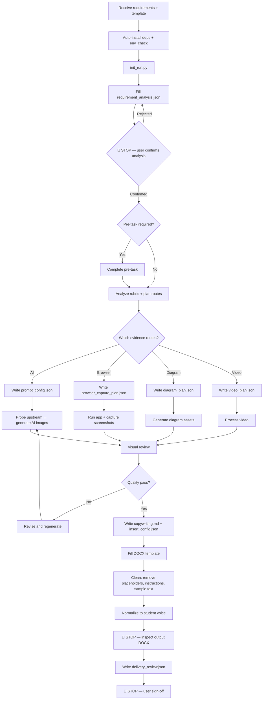

# auto-lab

Use this skill when the user wants a lab report generated from a requirement document and a Word template while preserving the template structure.

The executable workflow expects a `.docx` template for `python-docx` processing. If the user only has `.doc`, convert it before running `init_run.py`.

## Environment setup (agent-automated)

The agent MUST install all dependencies automatically before running any script. Do not ask the user to install anything manually.

### Required dependencies (install silently)

```bash
pip install requests python-docx Pillow
```

### Optional dependencies (install when route requires)

| Route | Install command |
|-------|----------------|
| `browser_capture` | `pip install playwright && playwright install chromium` |
| `video_analysis` / `screen_recording` | `pip install av opencv-python numpy mss` |
| `ai_simulated` | No extra pip install, but requires `.env` with `BASEURL` and `APIKEY` |

### Auto-setup procedure

1. Check if `python` is available. If not, report to user and stop.
2. Run `pip install requests python-docx Pillow` silently.
3. If `ai_simulated` route is planned, check `.env` exists and has `BASEURL`+`APIKEY`. If missing, copy `.env.example` to `.env` and ask the user to fill in the API key.
4. If `browser_capture` route is planned, run `pip install playwright && playwright install chromium`.
5. If video route is planned, run `pip install av opencv-python numpy mss`.
6. After installs, run `powershell -ExecutionPolicy Bypass -File scripts/env_check.ps1` to verify.
7. If env_check still reports FAIL after auto-install, report the specific failure to the user with the exact fix command. Only ask the user for manual intervention when auto-install cannot resolve it.

**Rule**: Environment issues are the agent's responsibility to fix. Only ask the user for semantic decisions (route choice, content review, delivery sign-off), not for `pip install`.

## Quick start

```
1. Auto-install dependencies (see "Environment setup" above)
2. python scripts/init_run.py --requirements <req> --template <tpl.docx> --output-dir <dir> --output-docx-name <result.docx>
3. Fill requirement_analysis.json → update requirement_checklist.json
4. 🔴 STOP — show analysis to user for confirmation
5. If pre-task needed → complete it → record in pre_task_plan.json
6. Plan figures → write copywriting.md + prompt_config.json + insert_config.json
7. python scripts/run_workflow.py gate --workflow <workflow.json>
8. python scripts/generate_images.py --check (if AI images needed)
9. python scripts/run_workflow.py images --workflow <workflow.json>
10. python scripts/run_workflow.py run --workflow <workflow.json>
11. 🔴 STOP — inspect output DOCX
12. Write delivery_review.json → 🔴 STOP — user sign-off
```

## Core behavior

- Default target tier is `excellent`.
- Scripts are the execution layer; the agent is the decision layer.
- If a choice depends on the assignment's actual meaning, grading intent, deliverable wording, or project reality, decide it from the requirement/prompt instead of from script defaults.
- The agent must read scoring requirements before writing.
- If the requirement depends on a pre-task such as building a system, implementing pages, preparing data, or producing intermediate artifacts, the agent must complete that pre-task before report writing.
- Only treat work as a mandatory pre-task when the requirement document explicitly requires real deliverables such as code, scripts, datasets, runnable data, project files, or other concrete outputs that the report depends on.
- Do not satisfy pre-tasks with demo-grade placeholder code, mock outputs, or "just enough to show something" artifacts. If the requirement asks for code, the code must be usable, requirement-aligned, documented, and handoff-ready.
- When a pre-task includes frontend or web-app implementation, the agent must initialize a git repository before coding and must use the vendored skill references for `baseline-ui`, `frontend-design`, and `webapp-testing`.
- "Pre-task completed" means the same quality bar as any normal coding delivery: required functionality implemented, required assets prepared, basic startup instructions documented, and tests or runtime checks performed.
- The agent must decide the figure plan before writing copy.
- The report voice must be that of a student submitting coursework, never that of an agent, assistant, or tool explaining what it did.
- `auto-lab` supports three visual routes:
  - `ai_simulated`: AI-generated realistic screenshots
  - `browser_capture`: real screenshots from the user's own local frontend/app flow
  - `diagram_assets`: generated diagrams for course-design figures such as function diagrams, flowcharts, data flow diagrams, and ER diagrams
- `auto-lab` also supports video evidence:
  - `video_analysis`: analyze existing operation videos and extract representative frames
  - `screen_recording`: record short local operation clips when screenshots are not enough
- `auto-lab` also supports prompt-driven submission packaging:
  - derive required deliverables from the requirement/prompt
  - package them as `submit.zip`
- A run may use one route or multiple routes together.
- A fresh run directory starts in a neutral planning state. Before validation or execution, fill `requirement_checklist.json` and choose the real route combination.

## Vendored companion skills

When the requirement includes real software delivery work, read and apply these vendored skill entrypoints before implementation:

- `vendor/minimax-docx/SKILL.md` for DOCX-safe structural editing
- `vendor/baseline-ui/SKILL.md` for frontend baseline constraints
- `vendor/frontend-design/SKILL.md` for production-grade frontend implementation quality
- `vendor/webapp-testing/SKILL.md` for local web-app testing and verification

If a vendor skill file is missing, report it as an error — do not silently skip.

## Workflow diagram



## Failure modes and recovery

| Scenario | Trigger | First action | Fallback |
|----------|---------|-------------|----------|
| Python not found | `python` command fails | Report to user with install instructions | Stop — cannot proceed |
| pip install fails | Network or permission error | Retry once with `--user` flag | Ask user to install manually |
| `.env` missing or incomplete | No `BASEURL`/`APIKEY` | Copy `.env.example` to `.env` | Ask user to fill API key |
| `env_check.ps1` reports FAIL | Missing module or tool | Auto-install the missing dependency | Report exact fix command to user |
| `init_run.py` error | Template not `.docx` / path missing | Check file path and format, retry | Ask user to confirm file |
| Upstream image API unreachable | `--check` returns failure | Wait 30s, retry once | Skip `ai_simulated`, use `diagram_assets` or text-only |
| Single AI image fails | API timeout / empty response | Auto-retry 3 times (built into script) | Record failed image name, continue others, note in copywriting.md |
| Visual review fails | localhost in image / density too high / overlaps | Revise prompt, regenerate | Skip that image, describe in text instead |
| Template fill script errors | `task_scripts/*.py` exception | Check if stub was replaced, fix paths | Fall back to `python-docx` simple fill, record reason in `requirement_analysis.json -> template_strategy.notes` |
| Video processing fails | PyAV/OpenCV both unavailable | Check ffmpeg installation | Skip video evidence, set `video_required=false` in checklist |
| Submission packaging fails | Files in `include_paths` don't exist | Check paths, fix `submission_package.json` | Stop, ask user to confirm files |
| Vendor skill file missing | `vendor/*/SKILL.md` not found | Report the specific missing skill name | Stop — do not silently skip |
| DOCX output has leftover placeholders | Gate 5/AG check命中 | Locate and replace each one with actual content | Re-run fill script |

## Anti-patterns — do NOT do these

| # | Anti-pattern | Consequence | Correct approach |
|---|-------------|-------------|-----------------|
| 1 | Use local scripts to generate fake screenshots when AI generation fails | Teacher spots fake images instantly, direct point deduction | Retry, skip the image, or switch routes |
| 2 | Overwrite the original template file | Template destroyed, no rollback | Always output to a new file |
| 3 | Let scripts make semantic decisions (how many images, which route) | Scripts don't understand course requirements | Agent decides, scripts execute |
| 4 | Use "dashboard" / "note" / "welcome" placeholder text in frontend code | Obviously template code | Use real content from the requirement document |
| 5 | Skip vendor skills and write frontend directly | Violates baseline-ui constraints | Read vendor/*.md before writing code |
| 6 | Deliver only `submit.zip` without a `submit/` folder | Hard to inspect and modify | Output both folder and zip |
| 7 | Add "AI版" / "完整版" / "final" suffixes to zip filename | Non-standard naming | Use `submit.zip` uniformly |
| 8 | Leave "请在此处填写" / "字号要求" template instructions in output DOCX | Teacher sees format rules instead of content | Remove all, keep only student content |
| 9 | Agent self-evaluates after making changes | Optimistic bias (accuracy only 46.4%) | Use independent sub-agent or human review |
| 10 | Run the entire workflow without any human confirmation | May go off-track irreversibly | Stop at every 🔴 checkpoint, wait for user |
| 11 | Fabricate timestamps in AI-generated screenshots | Unrealistic images | Use real current time in prompt |
| 12 | Use generic placeholder code in AI code/IDE screenshots | Screenshot doesn't match actual project | Pick core code snippets from the project for the prompt |

## Image routes — hard boundaries

### Route 1: `ai_simulated`

Use AI-generated screenshots for:
- terminal screenshots
- command output screenshots
- software / system configuration screenshots
- generic tool-operation visuals where exact local UI fidelity is not required
- IDE / code editor screenshots (when showing general coding environment)
- database management tool screenshots (e.g. MySQL Workbench, Navicat general UI)
- network/OS configuration panels

**Critical rule**: When the requirement says "real software screenshots" or Chinese equivalent, it means AI-generated realistic screenshots by default — NOT local browser capture and NOT fake local script outputs. Only use `browser_capture` when the requirement explicitly refers to the user's own frontend/app pages.

Do not use AI-generated screenshots for:
- local frontend pages that should match the running project
- self-built app/web product flows
- development software practice screenshots for the user's own app or web project
- function diagrams, flowcharts, data flow diagrams, or ER diagrams

### Route 2: `browser_capture`

Use browser/app screenshots for:
- frontend pages that require starting a local dev server
- pages from the user's own app or web project
- development software practice screenshots for the user's own app/web flow

Do not use browser capture for:
- unrelated third-party published apps
- terminal screenshots
- generic configuration figures that fit the AI route better
- function diagrams, flowcharts, data flow diagrams, or ER diagrams

### Route 3: `diagram_assets`

Use generated diagram assets for:
- function diagrams
- flowcharts
- data flow diagrams
- ER diagrams
- database schema diagrams
- system architecture diagrams (when specifically asked as diagrams, not as screenshots)

Do not use diagram assets for:
- terminal screenshots
- command output screenshots
- local frontend page screenshots
- published third-party product screenshots

### AI image constraints

- AI-generated screenshots with clock/time displays must show the **real current time**. Note the current date/time before generating and include it in the prompt.
- AI-generated code/IDE screenshots should use the **project's actual source code**. Pick the most representative snippet (main entry point, key class, or core logic) and include it in the prompt for visual fidelity.
- If AI image generation fails, do NOT fall back to local fake screenshots. Retry, skip, or switch routes.
- Before batch AI image generation, always probe upstream first: `python scripts/generate_images.py --check`

## Template filling rules

When filling a DOCX template:
- **Preserve**: template structure, heading hierarchy, page layout, table structure, styles, cover page, fixed text that is part of the assignment format (e.g. "课程名称：", "姓名：").
- **Remove**: template instructions ("请在此处填写", "（此处替换为...）"), format reminders ("字号要求：小四", "行距：1.5倍"), sample/example content, placeholder hints, rubric excerpts pasted as body text, and TOC residue that is empty or broken.
- **Replace**: all placeholder text like `[TODO]`, `占位`, `示例内容`, `样例` with actual student-content.
- **Use** `scripts/template_adapter.py` as a reusable library: `find_placeholders()`, `replace_placeholder_text()`, `insert_image_after_paragraph()`, `remove_template_instructions()`, `validate_output()`, `write_fill_script()`.
- The agent must customize `task_scripts/fill_template.py`, `insert_images.py`, and `verify_template.py` using `template_adapter` functions rather than writing everything from scratch.
- The final report must not contain teacher-facing instructions or format specifications as body paragraphs.

## Frontend code constraints

When implementing frontend code as a pre-task:
- Do not use placeholder text like "dashboard", "note", "placeholder", "示例", "样例" in visible UI.
- Do not use generic template copy (e.g., "Welcome to your dashboard", "Note content here").
- All visible text must be real content derived from the requirement.
- Code must be runnable, requirement-aligned, and handoff-ready — not demo-grade.

## Execution steps

1. **Auto-install dependencies** (see "Environment setup" above). Run `env_check.ps1` to verify.
2. **Initialize run directory**:
   ```
   python scripts/init_run.py --requirements <req> --template <tpl.docx> --output-dir <dir> --output-docx-name <result.docx>
   ```
3. **Read generated files**: `workflow.json`, `template_manifest.json`, `requirement_checklist.json`, `requirement_analysis.json`, `pre_task_plan.json`, `copywriting.md`, `prompt_config.json`, `browser_capture_plan.json`, `diagram_plan.json`, `video_plan.json`, `reference_template_cleanup.json`, `submission_package.json`, `insert_config.json`, `task_scripts/fill_template.py`, `task_scripts/insert_images.py`, `task_scripts/verify_template.py`.
4. **Fill `requirement_analysis.json`**, then reflect decisions into `requirement_checklist.json`.
5. 🔴 **STOP — show analysis to user for confirmation.** Do not continue until approved.
6. **Decide routes**: pre-task required? images required? which routes? video? submission package? Use `docs/prompts/pre_task_detection_rules.md` for pre-task judgment.
7. **If pre-task required**, complete it first. For frontend: init git, read vendor skills, build, write README, verify with webapp-testing. Record outputs in `pre_task_plan.json`.
8. **Analyze template** and customize `task_scripts/fill_template.py`, `insert_images.py`, `verify_template.py`.
9. **Write config files** as one coordinated set: `copywriting.md`, `prompt_config.json`, `browser_capture_plan.json`, `diagram_plan.json`, `video_plan.json`, `reference_template_cleanup.json`, `submission_package.json`, `insert_config.json`. Read `docs/prompts/prompt_driven_decisions.md` before writing.
10. **Visual review** per `docs/prompts/visual_review_rules.md`. Set `ai_visual_review_completed` / `diagram_visual_review_completed` only after passing.
11. **Validate**: `python scripts/run_workflow.py validate --workflow <workflow.json>`. 🔴 **STOP if errors** — fix before continuing.
12. **Probe upstream** (if AI images): `python scripts/generate_images.py --check`. 🔴 **STOP if fails** — retry or switch routes.
13. **Generate images**: `python scripts/run_workflow.py images --workflow <workflow.json>`.
14. **Process video** (if needed): `python scripts/run_workflow.py video --workflow <workflow.json>`.
15. **Package submission** (if needed): `python scripts/run_workflow.py package --workflow <workflow.json>`.
16. **Fill DOCX**: `python scripts/run_workflow.py run --workflow <workflow.json>`. 🔴 **STOP — inspect output**. Check for: leftover placeholders, broken TOC, agent-voice, template instructions as body text, missing images.
17. **Delivery review**: list every required deliverable, check each for correctness. Write `delivery_review.json`. 🔴 **STOP — user sign-off**.

## Files created by init_run.py

- `workflow.json`
- `template_manifest.json`
- `requirement_checklist.json`
- `requirement_analysis.json`
- `pre_task_plan.json`
- `copywriting.md`
- `prompt_config.json`
- `browser_capture_plan.json`
- `diagram_plan.json`
- `video_plan.json`
- `reference_template_cleanup.json`
- `submission_package.json`
- `insert_config.json`
- `task_scripts/*.py`

## JSON contracts

### requirement_checklist.json

Complete before report writing. Must record: `has_grading_rubric`, `target_tier`, `run_mode`, `pre_task_required`, `images_required`, `ai_images_required`, `browser_capture_required`, `diagram_assets_required`, `video_required`, `reference_template_cleanup_required`, `submission_package_required`, `ai_visual_review_completed`, `diagram_visual_review_completed`, `minimum_image_count`, `planned_figures`.

Cross-rules:
- `ai_images_required=true` → `prompt_config.json` must be populated
- `browser_capture_required=true` → `browser_capture_plan.json` must be populated
- `diagram_assets_required=true` → `diagram_plan.json` must be populated
- `video_required=true` → `video_plan.json` must be populated, `video_review_completed` must be `true`
- `submission_package_required=true` → `submission_package.json` must be populated, output must be both `submit/` folder and `submit.zip`
- `pre_task_required=true` → `pre_task_plan.json` must be enabled and completed
- `ai_visual_review_completed` and `diagram_visual_review_completed` must only be `true` after agent has visually inspected the images

### requirement_analysis.json

The agent's decision record. Fill after reading requirement, template, and project artifacts. Source of truth for semantic decisions. Must explain why each route was chosen and why pre-task is or is not required.

### delivery_review.json

Machine-checkable final acceptance record. Every required deliverable must appear with `present`, `correct`, and `notes` fields. `overall_pass` must be `true` only if every item passes.

```json
{
  "review_completed": true,
  "requirement_deliverables": [
    {
      "id": "D1",
      "description": "Final report (.docx)",
      "required": true,
      "present": true,
      "correct": true,
      "notes": ""
    }
  ],
  "issues_found": [],
  "overall_pass": true,
  "reviewer_notes": ""
}
```

## Verification checklist

Validation must confirm:
- Image count consistent across placeholders and configs
- Route planning exists when required
- Pre-task outputs exist when assignment depends on them
- AI prompts used only for allowed scopes
- AI screenshots: coherent background, low density, no localhost, real time, real project code
- AI failures not silently replaced with fake screenshots
- Upstream probed before batch generation
- Browser capture used only for local frontend/app pages
- Diagram assets used only for diagrams/flowcharts/ER
- Diagram visual review passed for routing, spacing, readability
- Video plans have explicit I/O paths and reviewed outputs
- Reference-template cleanup preserves cover/headings, removes body content
- Submission includes both `submit/` folder and `submit.zip`, named `submit.zip` without suffixes
- Frontend screenshots not routed through AI prompts
- Report not pure-text when rubric expects figures
- Template shell preserved
- Student voice, not agent voice
- Template instructions, placeholders, format reminders removed
- Code deliverables have startup instructions and verification
- Delivery review checked every deliverable against requirement
- `delivery_review.json` written
- Frontend code has no placeholder text
- Vendor skills applied for frontend pre-tasks

## Examples

- `examples/prompt_config.example.json`
- `examples/browser_capture_plan.example.json`
- `examples/diagram_plan.example.json`
- `examples/diagram_plan.database_course_design.example.json`
- `examples/diagram_plan.web_system.example.json`
- `examples/video_plan.example.json`
- `examples/reference_template_cleanup.example.json`
- `examples/submission_package.example.json`
- `examples/requirement_analysis.example.json`
- `examples/pre_task_plan.example.json`
- `examples/insert_config.example.json`
- `docs/prompts/visual_review_rules.md`
- `docs/prompts/pre_task_detection_rules.md`
- `docs/prompts/reference_template_cleanup_rules.md`
- `docs/prompts/submission_package_rules.md`
- `docs/prompts/prompt_driven_decisions.md`
